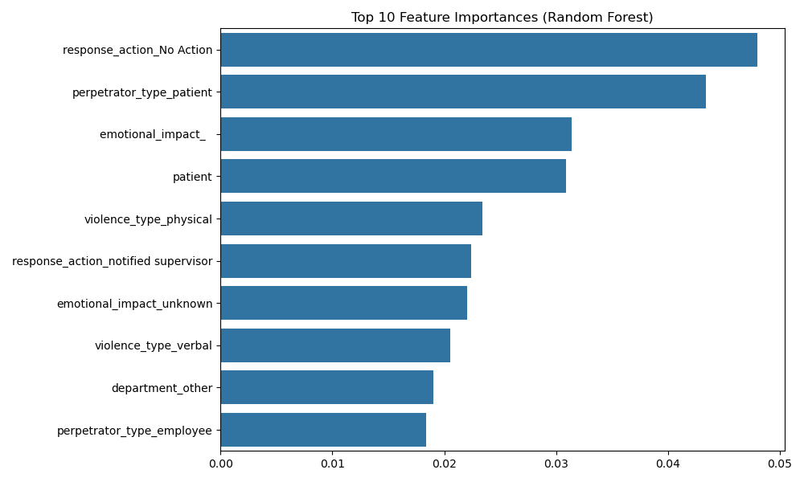

# Project Report: Predicting Emotional Impact Severity of Workplace Violence Incidents

This part aims to identify high-risk professions and departments in hospitals where workplace violence is most likely to occur and predict the emotional impact severity of such incidents using structured and textual features.

---

## Dataset Description

- **Source:** Cleaned and merged hospital workplace violence dataset
- **Final File Used:** `all_merged_labeled_contextual.csv`
- **Target Variable:** `emotional_impact_ML` (`Mild`, `Moderate`, `Severe`)
- **Feature Types:**
  - Structured: Profession, Department, Perpetrator Type, etc.
  - Text: Free-text descriptions of incidents (`assault_desc`)

---

## Data Preprocessing

- Removed rows with missing key values.
- Used `LabelEncoder` to encode the target class.
- Structured features were one-hot encoded.
- Text was transformed using `TF-IDF Vectorizer` (top 300 tokens).
- All features were merged into a sparse matrix and standardized.

---

## Handling Class Imbalance

To address severe class imbalance (e.g., far fewer `Severe` labels), we applied **SMOTE (Synthetic Minority Oversampling Technique)** only on the training set.

This helps avoid the model simply predicting the majority class.

---

## Classification Models

We trained three supervised classification models:

- **Logistic Regression**
- **Random Forest Classifier**
- **Support Vector Machine (SVM)**

Each model was trained on SMOTE-resampled training data and tested on original test data.

### Metrics Evaluated:
- Accuracy
- Precision, Recall, F1-score
- Macro Average and Weighted Average F1
- Per-class evaluation (`Mild`, `Moderate`, `Severe`)

**Confusion matrices** were plotted and saved:

#### Logistic Regression

> Shows moderate performance for identifying Severe cases, with some misclassification between Mild and Moderate.

#### Random Forest

> Most accurate model overall; better separation across all three emotional impact levels.

#### SVM

> Slightly underperforms compared to Random Forest, especially on Severe category.

---

## Feature Importance (Random Forest)

We extracted the top 10 most important features from the Random Forest model.

> Combines structured features (e.g., `victim_profession_nurse`) and important TF-IDF text terms that signal severity of incidents.

---

## SHAP Analysis (Model Explainability)

We used **SHAP (SHapley Additive exPlanations)** to interpret predictions made by the Random Forest.

> This visualization explains which features most frequently contribute to high-severity predictions. Structured features like profession and department, along with some textual indicators, show high influence.

---

## Unsupervised Analysis: KMeans + PCA

In addition to classification, we used unsupervised learning to explore cluster patterns:

- **Input:** Profession, Department, and Violence Type
- **One-hot encoding** followed by **PCA (2D)** for visualization
- Clustered using **KMeans (k=3)**

Output figure:

> Clusters show distinct role-department-violence groupings. For instance, Cluster 2 may correspond to high physical violence frequency among nurses in emergency settings.

We identified the top 3 values per cluster for:
- `victim_profession`
- `department`
- `violence_type`

---

## Summary of Results

| Model | Accuracy | Macro F1 | Weighted F1 | Severe F1 |
|-------|----------|----------|-------------|-----------|
| Logistic Regression | ~0.68 | ~0.56 | ~0.69 | ~0.47 |
| Random Forest       | ~0.75 | ~0.66 | ~0.75 | **~0.55** |
| SVM                 | ~0.70 | ~0.56 | ~0.69 | ~0.42 |

- **Random Forest** produced the most balanced and interpretable results.
- **SMOTE** greatly improved performance for the minority `Severe` class.
- **SHAP** and feature importance helped interpret top influencing factors.
- **Clustering** revealed distinct groupings of incident types and departments.

---

## Future Improvements

- Add LSTM/BERT embeddings for deeper semantic understanding of text
- Explore time-of-day or shift-based patterns (add temporal dimension)
- Combine unsupervised and supervised predictions for ensemble modeling

---

## Final Thoughts

This part demonstrates how machine learning can be effectively applied to sensitive healthcare incident data to:

- Predict risk levels
- Identify systemic issues
- Guide data-driven interventions for workplace safety

With explainable outputs and visual insights, the solution supports both technical understanding and stakeholder communication.