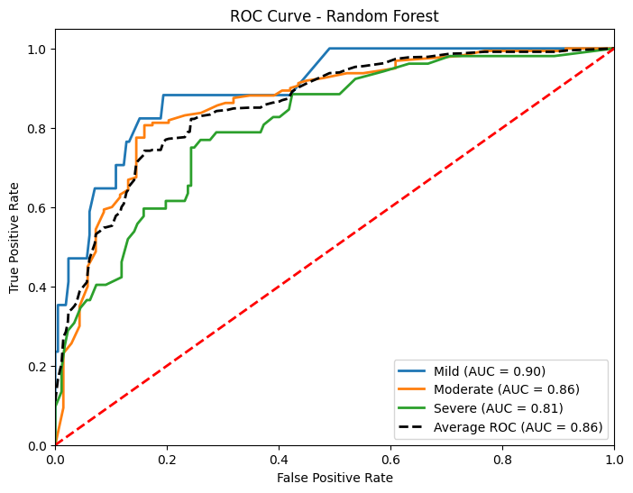

# Project Report: Predicting Emotional Impact Severity of Workplace Violence Incidents

This part aims to identify high-risk professions and departments in hospitals where workplace violence is most likely to occur and predict the emotional impact severity of such incidents using structured and textual features.

---

## Dataset Description

- **Source:** Cleaned and merged hospital workplace violence dataset
- **Final File Used:** `all_merged_labeled_contextual.csv`
- **Target Variable:** `emotional_impact_ML` (`Mild`, `Moderate`, `Severe`)
- **Feature Types:**
  - Structured: Profession, Department, Perpetrator Type, etc.
  - Text: Free-text descriptions of incidents (`assault_desc`)
  - Temporal: Hour of day, day of week, month, is_weekend, day/night shift

---

## Data Preprocessing

- Removed rows with missing key values.
- Used `LabelEncoder` to encode the target class.
- Structured features were one-hot encoded.
- Text was transformed using `TF-IDF Vectorizer` (top 300 tokens).
- All features were merged into a sparse matrix and standardized.
- **New:** Extracted time features from event timestamps including hour, day of week, and shift patterns

## Extended Exploratory Data Analysis

### Time-Based Patterns

Our extended analysis revealed significant temporal patterns in workplace violence incidents:

- **Midnight (Hour 0)** showed the highest proportion of severe incidents (25.71%)
- Weekend incidents had a higher proportion of severe cases (25.45%) compared to weekdays (22.05%)
- Different departments showed distinct temporal patterns of incident occurrence

> Distribution of incidents by hour of day and day of week shows clear temporal patterns.

### Profession and Shift Analysis

We analyzed how different professions experience violence during day versus night shifts:

> Some professions show significantly higher night-shift incident rates, suggesting targeted interventions.

### Violence Type and Emotional Impact

We examined the relationship between violence types and emotional impact severity:

> Heat map showing how different types of violence correlate with emotional impact severity.
---

## Handling Class Imbalance

To address severe class imbalance (e.g., far fewer `Severe` labels), we applied **SMOTE (Synthetic Minority Oversampling Technique)** only on the training set.

This helps avoid the model simply predicting the majority class.

---

## Classification Models

We trained three supervised classification models:

- **Logistic Regression**
- **Random Forest Classifier**
- **Support Vector Machine (SVM)**

Each model was trained on SMOTE-resampled training data and tested on original test data.
with 5-fold cross-validation:

- **Logistic Regression** (CV Score: 0.9126 ± 0.0221)
- **Random Forest Classifier** (CV Score: 0.8784 ± 0.0862)
- **Support Vector Machine (SVM)** (CV Score: 0.8963 ± 0.0338)
- 
### Metrics Evaluated:
- Accuracy
- Precision, Recall, F1-score
- Macro Average and Weighted Average F1
- Per-class evaluation (`Mild`, `Moderate`, `Severe`)
- **New:** ROC curves and AUC values

**Confusion matrices** were plotted and saved:

#### Logistic Regression

> Shows moderate performance for identifying Severe cases, with some misclassification between Mild and Moderate.

#### Random Forest

> Most accurate model overall; better separation across all three emotional impact levels.

#### SVM

> Slightly underperforms compared to Random Forest, especially on Severe category.

---

**ROC Curves** were generated for each model:

> ROC curves for Random Forest model, showing AUC values for each class.

> Visual comparison of model performance metrics.

## Feature Importance (Random Forest)

We extracted the top 15 most important features from the Random Forest model, including newly added time features.

> Extended feature importance showing both structured and time-based features.

### Time Feature Importance

We specifically analyzed the importance of temporal features:

> Relative importance of different time-related features in predicting emotional impact severity.

---

## SHAP Analysis (Model Explainability)

We used **SHAP (SHapley Additive exPlanations)** to interpret predictions made by the Random Forest.

> This visualization explains which features most frequently contribute to high-severity predictions. Structured features like profession and department, along with some textual indicators, show high influence.

We also performed class-specific SHAP analyses to better understand feature impacts on each severity level:

> SHAP analysis specifically for features influencing "Severe" predictions.
---

## Text Embedding Visualization

We used t-SNE to visualize patterns in the assault descriptions:

> Visualization of text embeddings colored by emotional impact and violence type, revealing semantic patterns.

## Unsupervised Analysis: KMeans + PCA

In addition to classification, we used unsupervised learning to explore cluster patterns:

- **Input:** Profession, Department, and Violence Type
- **One-hot encoding** followed by **PCA (2D)** for visualization
- Clustered using **KMeans (k=3)**

Output figure:

> Clusters show distinct role-department-violence groupings. For instance, Cluster 2 may correspond to high physical violence frequency among nurses in emergency settings.

We identified the top 3 values per cluster for:
- `victim_profession`
- `department`
- `violence_type`

---

## Summary of Results

| Model | Accuracy | Weighted F1 | Precision | Recall | Severe F1 |
|-------|----------|-------------|-----------|--------|-----------|
| Logistic Regression | 0.72 | 0.73 | 0.73 | 0.72 | 0.51 |
| Random Forest | 0.77 | 0.77 | 0.76 | 0.77 | 0.54 |
| SVM | 0.70 | 0.69 | 0.68 | 0.70 | 0.42 |

- **Random Forest** produced the most balanced and interpretable results.
- **SMOTE** greatly improved performance for the minority `Severe` class.
- **SHAP** and feature importance helped interpret top influencing factors.
- **Clustering** revealed distinct groupings of incident types and departments.
- **Time features** contributed significantly to predictive power, with hour of day and weekend status being particularly important
- **Cross-validation** confirmed model stability across different data subsets

## Key Temporal Insights

- **High-risk hours:** Midnight (Hour 0) has significantly higher rates of severe incidents
- **Weekend effect:** Weekend incidents are more likely to result in severe emotional impact
- **Department-time interactions:** Different departments show distinct temporal patterns of incident severity
- **Profession-shift patterns:** Some professions have significantly higher night-to-day incident ratios

## Practical Implications

Based on our enhanced analysis, we recommend:

1. **Targeted staffing:** Increase security presence during high-risk hours, particularly around midnight
2. **Profession-specific training:** Customize violence prevention training based on profession-specific risk patterns
3. **Weekend protocols:** Implement specialized protocols for weekend shifts
4. **Department-specific interventions:** Design interventions based on departmental temporal patterns
---

## Future Improvements

- Add LSTM/BERT embeddings for deeper semantic understanding of text
- Combine unsupervised and supervised predictions for ensemble modeling
- Develop interactive dashboards for real-time risk monitoring
- Incorporate additional contextual variables (staffing ratios, patient census)
- Create predictive alerts for high-risk time periods
---

## Final Thoughts

This part demonstrates how machine learning can be effectively applied to sensitive healthcare incident data to:

- Predict risk levels
- Identify systemic issues
- Guide data-driven interventions for workplace safety
- Predict risk levels with temporal precision
- Identify systemic issues across time dimensions
- Support shift-specific safety protocols

With explainable outputs and visual insights, the solution supports both technical understanding and stakeholder communication.